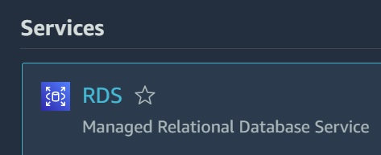
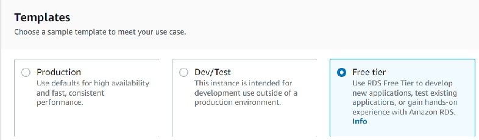
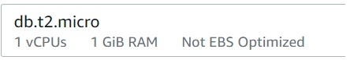
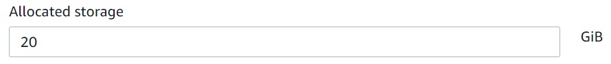
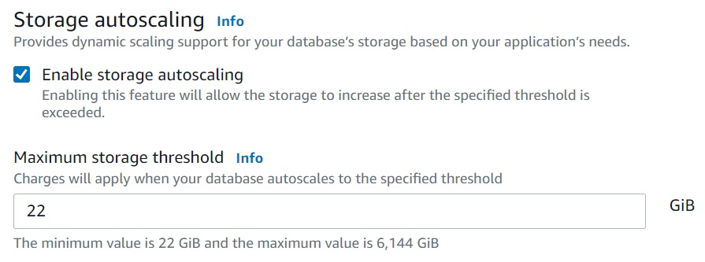
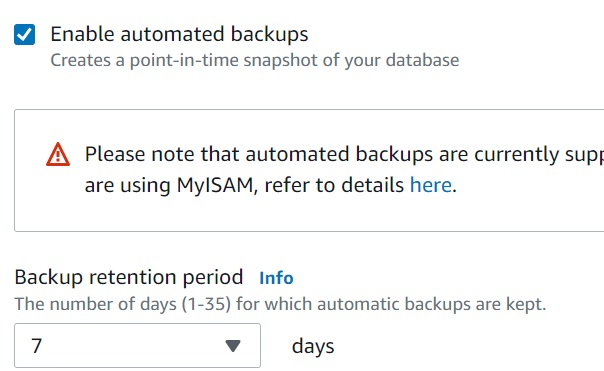
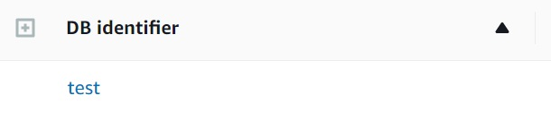

## Create a MySQL Database with RDS(AWS)

Got to your AWS Console & Search for RDS then Open it.

Now click on Create a Database

Now select the Engine we are using MySQL with version 8.0.30

Templates Should be Free Tier, so it will not charge anything

Give your Database Name & Password (should be 8 characters)

Choose Instance as db.t2.micro 
<kbd></kbd>
 
Storage Allocated as 20 GiB

Enable Storage Autoscaling, we are using 22 Gib as Maximum threshold 

We are also Activating the Backups with 7 Days of Retention 

Let the remaining Settings as it is & Click on Create a Database.

It will Take Some Time to Create a Database, MySQL Database Successfully Created with RDS AWS Service

Follow For More Devops: -

https://www.linkedin.com/in/devops-learning
