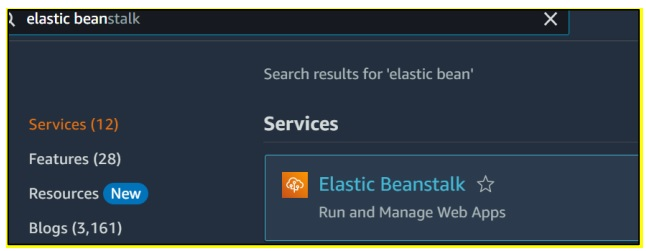
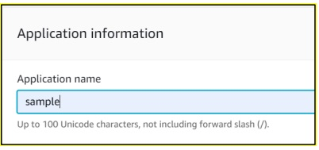
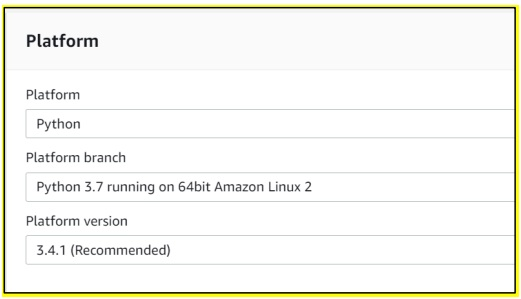
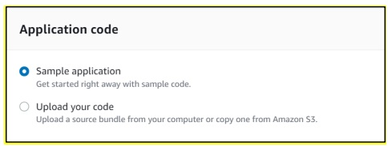
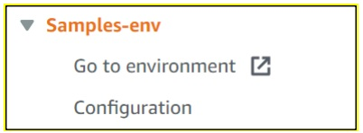
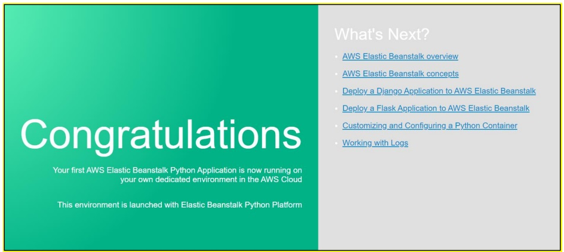

## Elastc Beanstalk Python Application on AWS

Search Elastic Beanstalk on your AWS Console 

Open Elastic Beanstalk and Click on Create Application 

Now Give Your Application Name 

In Platform Select Platform as Python In Platform Branch we are using Python 3.7 In Platform Version select 3.4.1 for reference use the below Image

In Application Code we are using Sample Application Provided by AWS.

After that Click on Create Application, Now it will take 5-10 minutes to create the application & environment.

Wait until the application & environment is created by AWS, Once its created you can see below screen.

Now click on Go to Environment in your application section of your right side.

Now you can see website successfully hosted with the Elastic Beanstalk.

Follow For More Devops: -

https://www.linkedin.com/in/devops-learning
