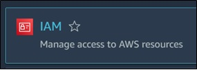
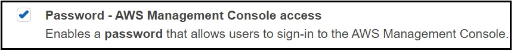
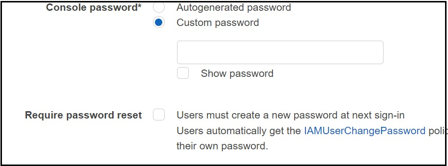
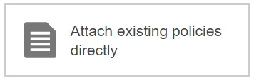
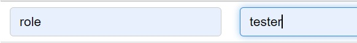

## Create an Admin User with IAM (AWS)

Go to AWS Console search For IAM and open the Service

 
<kbd align="center"></kbd>
 

After that click on Users, select Add Users

Now give username for that User

In AWS Credential Type Select Password- AWS Management Console Access 

 
<kbd align="center"></kbd>
 

Use Custom Password & Unselect checkbox for require password reset

 
<kbd align="center"></kbd>
 

After that Click on Next 

Now in Set Permissions select Attach Existing Policies Directly 

 
<kbd align="center"></kbd>
 

In Policies select `Administrator Access`

 
<kbd align="center"></kbd>
 

Click on Next Tags

We are using tags as key(`role`)=Value(`tester`), You can give anything as per your needs

 
<kbd align="center"></kbd>
 

After that Click on Next & Click on Create User

Your IAM Admin User is Successfully Created

To access the user, go to IAM & then users click on your username 

Go to security Credentials & Console-sign in link Given in the summary 

 
<kbd align="center"></kbd>
 

Enter your Username & Password & click on Sign in.

Now you can use your IAM user with all Access except Billing Dashboard.

Note: - It is very necessary to not use your root user account for any services, the best practices 
always suggest to create a new user admin user by Admin.

Follow For More Devops: -
https://www.linkedin.com/in/devops-learning
