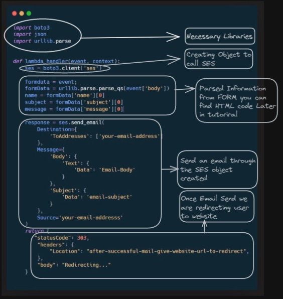

# Exercise: Create a Lambda function that sends an email using AWS SES

<p align="center">
  <em>Architectural Diagram</em>
  <br>
</p>


## Prerequisites:
- AWS Account
- An S3 bucket where you will host the HTML form
- An email address for Amazon SES
- Basic Knowledge About S3, Lambda Functions & Amazon SES

## Steps:
1. Create an AWS SES email address and verify it
2. Create an S3 bucket to host your form
3. Create an AWS Lambda function
4. Create a new API Gateway and connect it to your Lambda function
5. Update the form action attribute to the API Gateway API endpoint URL
6. Test the form submission by filling out the form fields and submitting the form
7. Check your recipient email box

### Step 1:
- Go to your AWS Console and open Simple Email Service (SES)
- Click on `Create Identity`
- Provide your email address and click on `Create Identity`
- Verify the email address by opening the AWS mail
- Once your Verification Done you can see the status as shown in below image


### Step 2:
- Follow the tutorial on how to host a static website on S3 bucket
  - [AWS S3 tutorial for hosting a static website]([https://www.linkedin.com/posts/devops-learning_resumes3cloudfrontroute53awscertificatemanager-activity-7015715474747371520-4pHv?utm_source=share&utm_medium=member_desktop])

### Step 3:
- Go to Amazon Console and search for `Lambda`
- Open the `Lambda Service` and click on `Create Function`
- Provide the function name and runtime architecture (we're using Python)
- Add the necessary code and deploy it
<p align="center">
  <em>Code Explained in below Diagram</em>
  <br>
</p>



```
import boto3
import json
import urllib.parse


def lambda_handler(event, context):
    ses = boto3.client('ses')
    
    formdata = event;
    formData = urllib.parse.parse_qs(event['body'])
    name = formData['name'][0]
    subject = formData['subject'][0]
    message = formData['message'][0]

    response = ses.send_email(
        Destination={
            'ToAddresses': ['your-email-address']
        },
        Message={
            'Body': {
                'Text': {
                    'Data': 'Email-Body'
                }
            },
            'Subject': {
                'Data': 'email-subject'
            }
        },
        Source='your-email-addresss'
    )
    return {
       "statusCode": 303,
        "headers": {
            "Location": "after-successful-mail-give-website-url-to-redirect",
        },
        "body": "Redirecting..."
    }
```
- Give the Lambda function access to SES by creating a role and providing necessary policies
  - Go to `IAM` -> `Roles`
  - Create a role and provide the following policies:
    - `AmazonSESFullAccess`
    - `AWSLambdaExecute`
  - Assign the role to the Lambda function in the `Permissions` tab of the function configuration

### Step 4:
- Open the `Lambda Service` in AWS
- Go to `Configuration` -> `Triggers` -> `Add Trigger`
- Select `API Gateway` as the source and create a new `REST API`
- Copy the endpoint URL and save it

### Step 5:
- Go to your S3 bucket and download the form HTML page
- Modify the `action` attribute in the form to use the API Gateway endpoint URL
- Check the Below Image for Reference


### Step 6:
- Test the application by filling out the form


### Step 7:
- Check your recipient email box to see if the email was sent successfully
- As you can see i have received the below response 
<br>


Follow For More Devops: -

https://www.linkedin.com/in/devops-learning
