## Application Load Balancer on AWS

### Pre-requisites: -

1) Create 2 different instances where 2 different websites hosted on that machines as shown in the image.

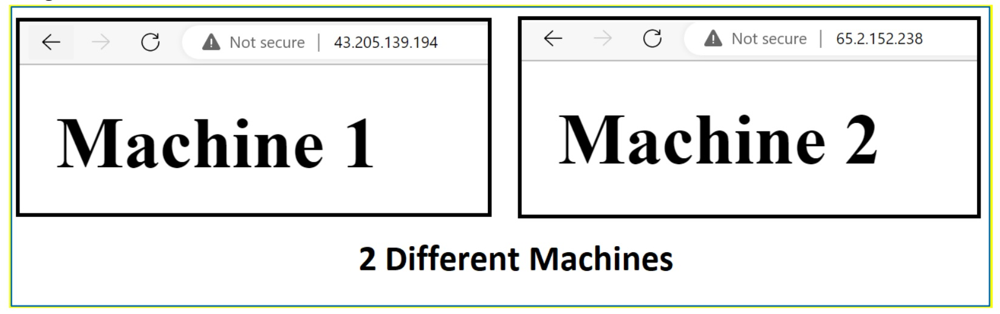

2) Create a Security Group (where inbound & outbound rules specify as per the needs)

3) Create a Target Group (where 2 instances allocated as per the requirement)

### Create a Security Group (with specific inbound/outbound rules)
Search Security Groups on your AWS Console.

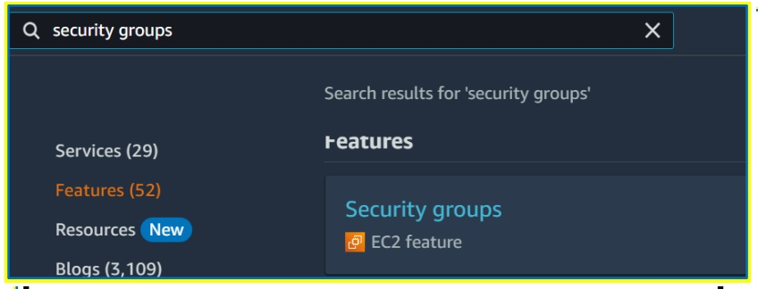

Now open security Groups and click on Create a New Security Group

Now give a name & description for your Security Group.

Specify the Inbound rule as HTTP and Source anywhere so your website is accessible globally.

Note: Its important to specify inbound rule as HTTP & Source as anywhere.

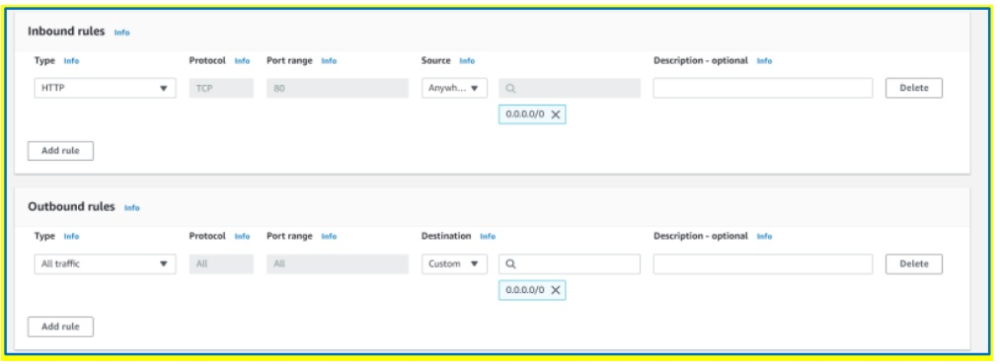

Now Click on Create a New Security Group

### Create a Target Group (where you specify instances for your load balancer)

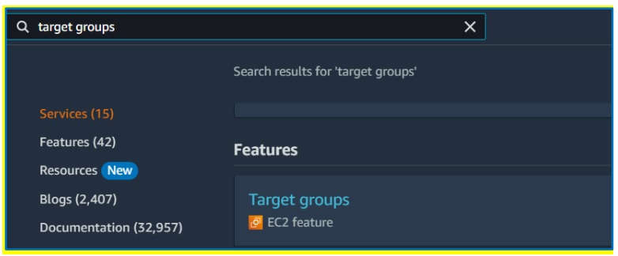

Search Target Groups on your AWS Console.

Now open Target Groups and click on Create a Target Group

Give a name for your target group and let the all settings remain as it is.

For Settings Refer the below image.

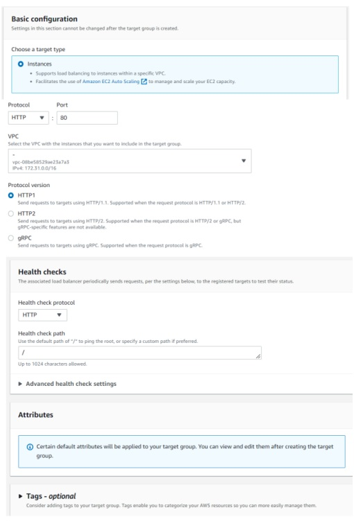

Now click on next. After clicking Next choose the 2 Available instances and click on include as pending refer the below Image.

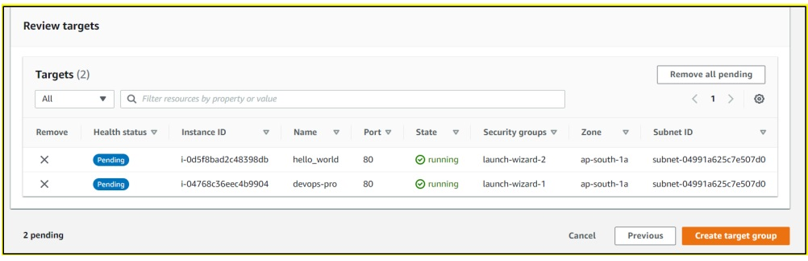

In review targets you can see 2 instances as shown in the image now click on Create a Target Group.

Now you are ready to go to create a new application load balancer as your pre-requisites are completed.

#### Create a Application Load Balancer (Which is our Main Goal)
Go to your EC2 dashboard and search for load balancing ec2.

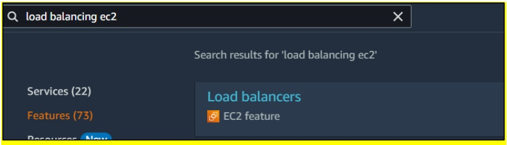

Now open Load Balancers and click on Create a Load Balancer, after that choose Application load balancer and click on create.

Give your Load Balancer Name. In Network mapping select all the subnets are available as shown in the image. (Select all the available subnets)

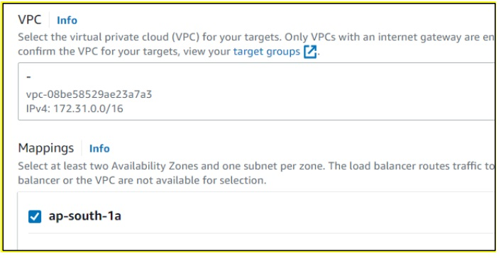

Now select your security group and target group which we are created for the pre-requisites.

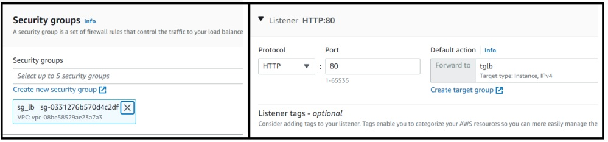

Now click on Create Load Balancer.

Once your load balancer state is active you can use your load balancer 

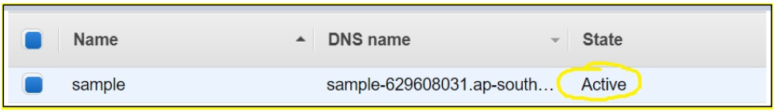

Now open the website with the help of DNS Name copy that URL and open it in new tab.

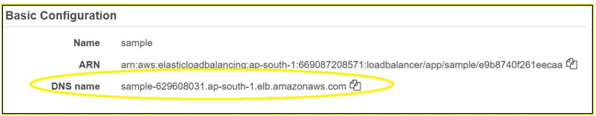

In the Below Image you can see with 1 URL we can visit 2 different websites hosted on 2 different machines.

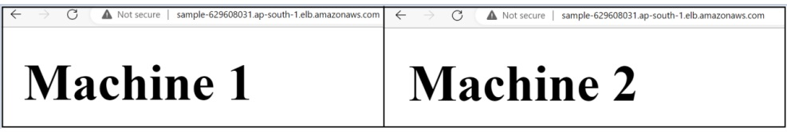

Follow For More Devops: -

https://www.linkedin.com/in/devops-learning
