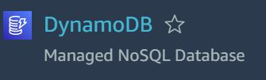

## Create a NoSQL Database with the help of DynamoDB

Go to your AWS Console search for DynamoDB & Open it.

 
<kbd align="center"></kbd>
 

After that Open Tables & Click on Create Table

Enter Your Table Name

While Entering Partition Key check for the data type you are using, we are using Number here.

 
<kbd align="center"></kbd>
 
 
After that check for the Table Setting, it should be Default Settings.

 
<kbd align="center"></kbd>
 

We are creating Tag as Key(School) and Value(intdev)

 
<kbd align="center"></kbd>
 

Finally Verify the Configurations & Click on Create Table

NoSQL Database Table Successfully Created by DynamoDB Service

 
<kbd align="center"></kbd>
 

Follow For More Devops: -
https://www.linkedin.com/in/devops-learning
