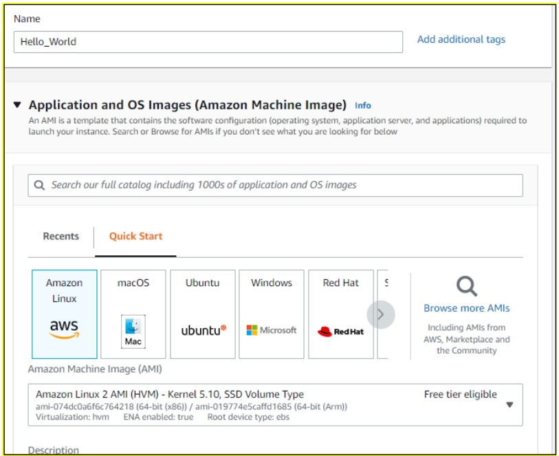
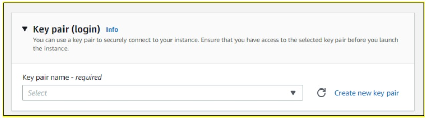
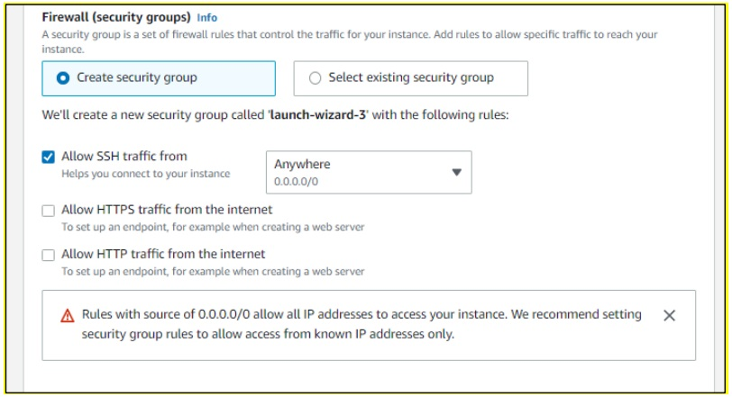
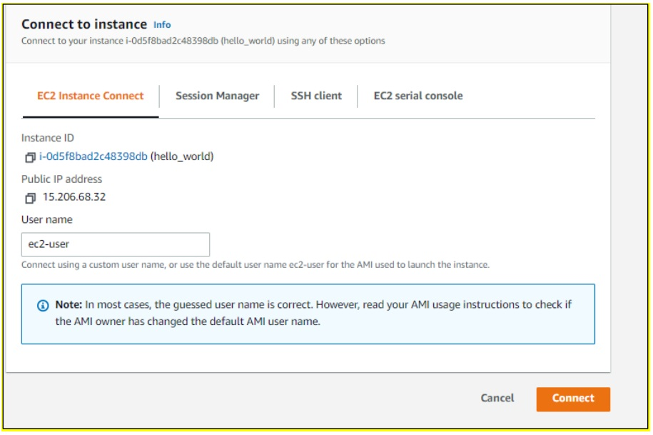
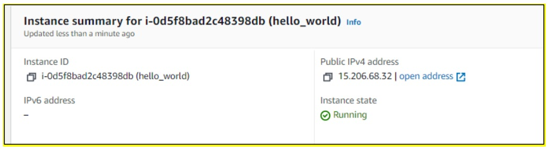

## Host a Static website on EC2

Launch an EC2 instance by login into your AWS Account we are using Amazon Linux 2
<p align="center"></p>
Create a new key pair to connect to your instance.
<p align="center"></p>
Allow HTTP Traffic for your instance by enabling the checkbox. 

Note: - Without HTTP Access your website is not accessible globally.
<p align="center"></p>
Now Connect to your Instance.
<p align="center"></p>
Now the most important steps.

Install the Apache Server By using Below Command

```
yum install –y httpd
```

Now start the Apache service by using below command

```
systemctl start httpd
```

Now to run Apache Service automatically at startup use the below command 

```
systemctl enable httpd
```

Now to put your html code to the file use below command

```
echo “<h1>Hello World</h1>” /var/www/html/index.html
```

Now Access your website with the public IPV4 address.
<p align="center"></p>

<p align="center"></p>

Follow For More Devops: -

https://www.linkedin.com/in/devops-learning
