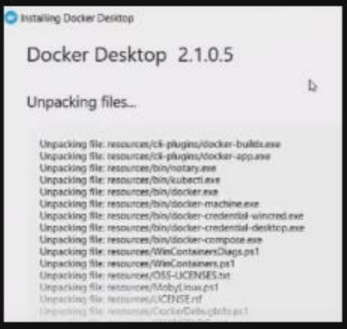
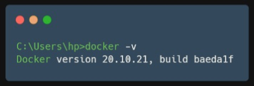
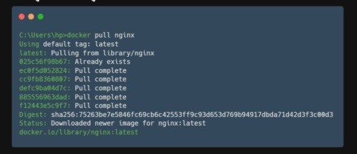
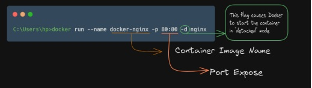
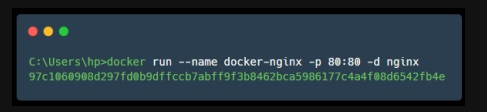
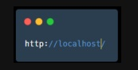
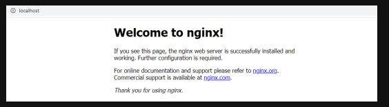

## How to Install Docker & Run your First Docker Container

Steps:-

i) Visit the Below Link & Download the Docker Setup, for Demo we are using Windows Operating System.

https://www.docker.com/

ii) Once the setup is Downloaded run the installer exe.

iii) Choose your configuration let it be as default then after Docker will Install itself.

<p align="center"></p>

iv) Once Docker is install restart your operating system.

v) Now to check that Docker is successfully installed run the below command on command prompt or PowerShell. Once the command is executed
you can see the version of Docker in CMD.

```
docker -v
```
<p align="center"></p>


Let's Install the (Nginx) Image & run the container.


vi) To install the Nginx Image run the below command

```
docker pull nginx
```
<p align="center"></p>


Once the image is successfully pull we can run the container.


vii) We are Running the container at port 80 to run the Nginx Image 
execute the below command
                                                                
```
docker run --name docker-nginx -p 80:80 -d nginx
```
<p align="center"></p>


once the command is executed you can see there is one container id 
generated by docker


<p align="center"></p>


viii) To verify that your Nginx Container is successfully running go to 
browser and hit the below URL

<p align="center"></p>


You can see your Nginx Container is Running Successfully.


<p align="center"></p>


Note:- To stop the docker container go to your Docker Desktop,
go to containers section delete or pause the container docker-nginx

Follow For More
https://www.linkedin.com/in/devops-learning
